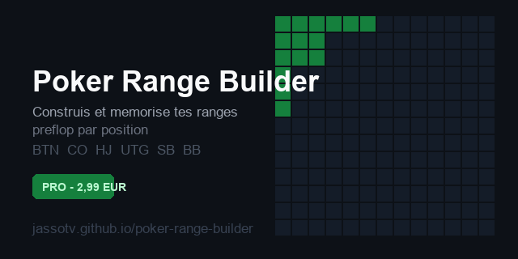

  

<h1 align="center">Poker Range Builder</h1>

  Construis et mémorise tes ranges préflop par position — MTT &amp; cash game

  
  
  
  

---

## Fonctionnalités

- **6 positions** : BTN · CO · HJ · UTG · SB · BB
- **3 situations** : Open, vs Limp, vs Raise
- **Actions** : Raise/Open · Call/Limp · 3-Bet · Fold
- **Compteur de combos** en temps réel (% + nombre de combos)
- **Notes par position** : mémorise tes annotations
- **Export PNG** de la range courante
- **Mode Antes** activable
- **Persistance localStorage** — tes ranges sont sauvegardées automatiquement

---

## Version PRO

Débloque toutes les fonctionnalités avancées pour **2,99€ (accès à vie)**.

👉 [Acheter sur Gumroad](https://jassotv.gumroad.com/l/poker-range-builder-pro)

Clé d'activation à entrer sur la [page Pro](https://jassotv.github.io/poker-range-builder/premium.html).

---

## Licence

Projet personnel — © JassoTV. Le code source est fourni à titre éducatif.
